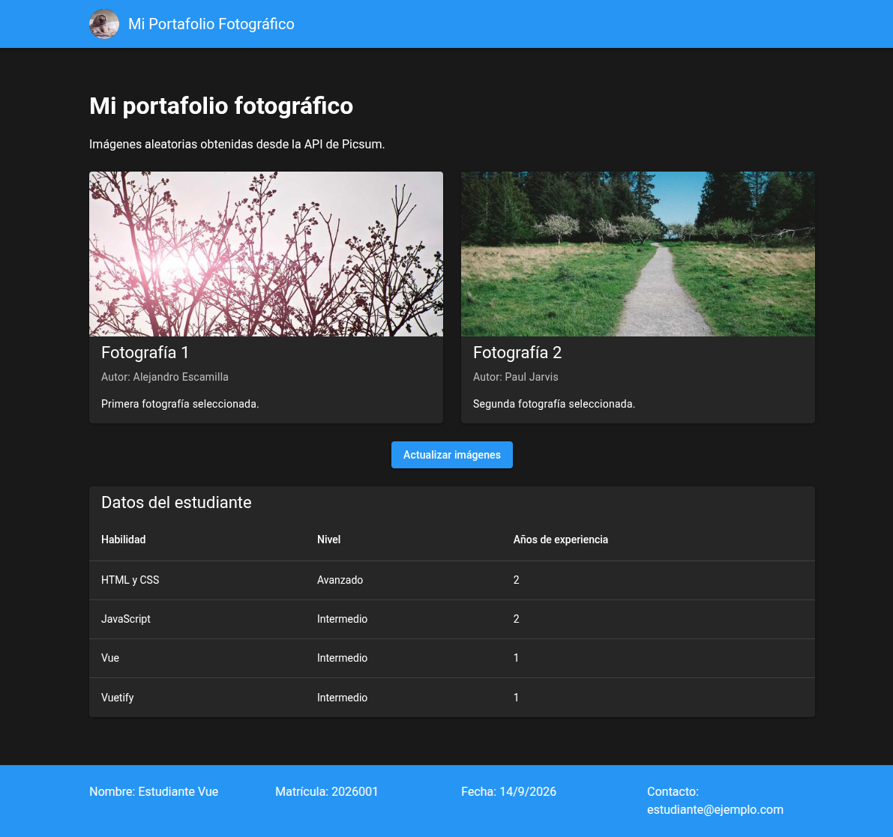

# Aplicación Vue y Vuetify

Aplicación sencilla de portafolio que muestra dos fotografías diferentes de la API de Picsum y los datos básicos del estudiante.

## Captura de pantalla



## Instalación y ejecución

```bash
pnpm install
pnpm run dev
```

Para revisar el proyecto:

```bash
pnpm run type-check
pnpm run lint
pnpm run build
```

## Tecnologías

- Vue 3 y Composition API.
- Vuetify 4.
- Vite y TypeScript.
- Fetch API y Picsum Photos.

## Componentes

- `AppHeader.vue`: encabezado con logo y título.
- `AppFooter.vue`: datos del estudiante y fecha actual.
- `TarjetaConImagen.vue`: tarjeta reutilizable con props.
- `TablaDatos.vue`: tabla de habilidades.
- `pages/index.vue`: tarjetas, botón, estados de carga/error y tabla.
- `services/picsumApi.ts`: petición y selección de dos imágenes distintas.

## Estructura principal

```text
src/
├── App.vue
├── pages/index.vue
├── components/
├── services/picsumApi.ts
└── plugins/vuetify.ts
```
